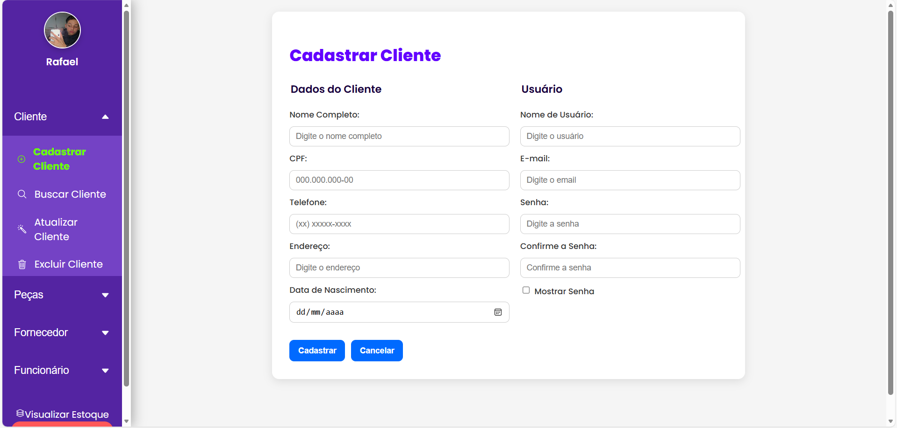
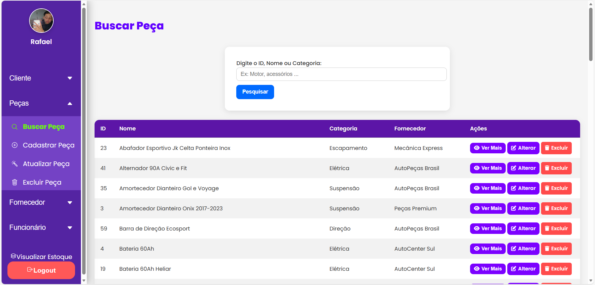
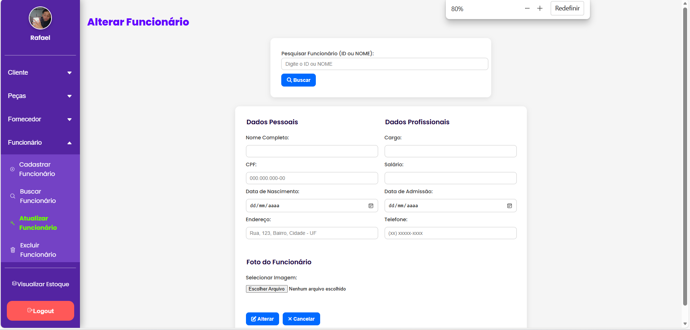
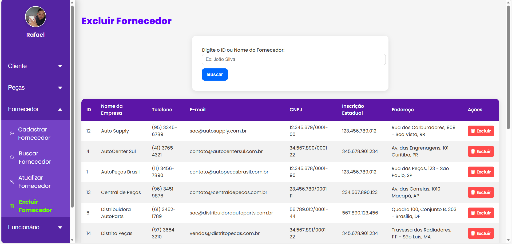

# Vortex-AutoPecas
Projeto Acadêmico – Sistema Web de Gerenciamento de Estoque para Autopeças - Protótipo de Loja Online de Autopeças - Desenvolvimento completo de um sistema Web com HTML, CSS3, JavaScript, PHP e MySQL

---

## 📸 Telas do Sistema

<table>
  <tr>
    <td align="center">
      <strong>Tela de Login</strong> 
      
    </td>
    <td align="center">
      <strong>Tela de Recepção</strong> 
      
    </td>
  </tr>

  <tr>
    <td align="center">
      <strong>Tela de Cadastro</strong> 
      
    </td>
    <td align="center">
      <strong>Tela de Busca</strong> 
      
    </td>
  </tr>

  <tr>
    <td align="center">
      <strong>Tela de Atualizar</strong> 
      
    </td>
    <td align="center">
      <strong>Tela de Excluir</strong> 
      
    </td>
  </tr>

  <tr>
    <td align="center">
      <strong>Tela Inicial – Loja</strong> 
      
    </td>
    <td align="center">
      <strong>Tela Unitária de Produto</strong> 
      
    </td>
  </tr>

  <tr>
    <td align="center">
      <strong>Tela Produtos</strong> 
      
    </td>
    <td align="center">
      <strong>Carrinho de Compras</strong> 
      
    </td>
  </tr>

  <tr>
    <td align="center" colspan="2">
      <strong>Histórico de Compras</strong> 
      
    </td>
  </tr>
</table>
