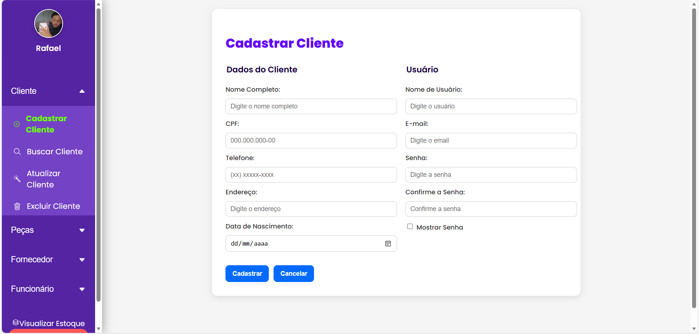
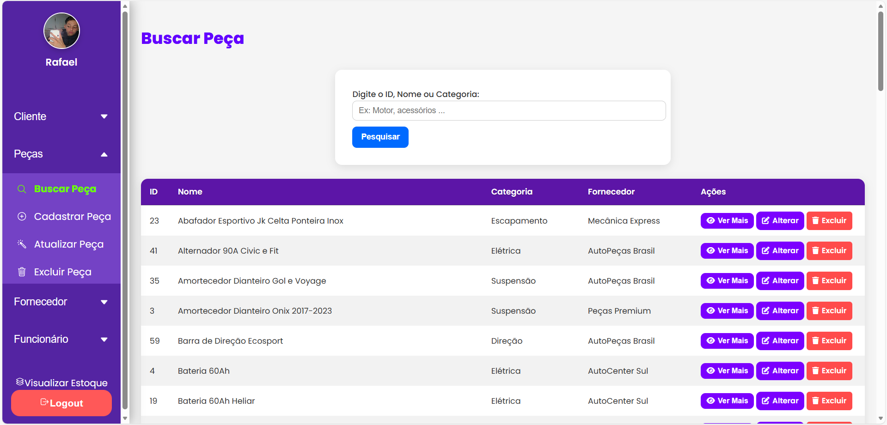
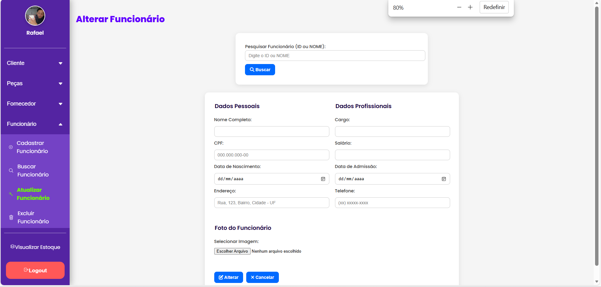
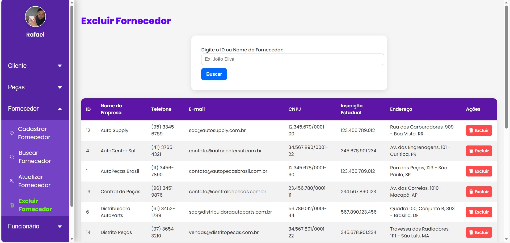

# Senna-AutoPecas
Projeto Acadêmico – Sistema Web de Gerenciamento de Estoque para Autopeças - Protótipo de Loja Online de Autopeças - Desenvolvimento completo de um sistema Web com HTML, CSS3, JavaScript, PHP e MySQL

---

# 📌 Visão Geral
Este sistema foi desenvolvido para gerenciar o estoque e as vendas de uma empresa do setor de autopeças, permitindo o controle organizado de varios setores. O sistema possibilita o acompanhamento das movimentações de entrada e saída de produtos, contribuindo para uma gestão mais eficiente e confiável do estoque.

Além do controle interno, o projeto conta com um protótipo de loja online, no qual os clientes podem visualizar os produtos disponíveis, realizar cadastros, efetuar compras, utilizar carrinho de compras e acompanhar o histórico de pedidos. A proposta é facilitar tanto a administração da empresa quanto a experiência de compra do cliente.

Este projeto foi desenvolvido como parte de uma atividade acadêmica do Curso Técnico SENAI em Desenvolvimento de Sistemas, com a intenção de aplicar conhecimentos aprendidos de HTML, CSS, JavaScript, PHP, modelagem de sistemas e banco de dados.

---
# ⚙️ Funcionalidades do Gerenciamento de Estoque

## Perfis de Acesso
- Distinção de diferentes níveis de perfis de usuários.

## CRUDs
- CRUD de Cliente.
- CRUD de Peça/Produto.
- CRUD de Fornecedor.
- CRUD de Funcionário.

---

# ⚙️ Funcionalidades da Loja Online

## Página unitaria de produto com:
  - Exibição de informações detalhadas e imagens.
  - Alteração da quantidade com atualização do valor.
  - Adicionar produto ao carrinho.
  - Cálculo de frete.
  - Exibição de produtos relacionados.

## Filtragem de Produtos
  - Categoria.
  - Marca.
  - Faixa de preço.
  - Fornecedor.

## Carrinho de Compras
- Visualização dos produtos adicionados ao carrinho.
- Alteração da quantidade dos produtos, com atualização do valor unitário e do valor total da compra.
- Remoção de produtos do carrinho.
- Finalização da compra.

## Histórico de Compras
- Exibição dos produtos adquiridos e seus respectivos valores.
  
---

# 🛠️ Tecnologias Utilizadas

- HTML5
- CSS3
- JavaScript
- PHP 7.4+
- MySQL
- PHPmyAdmin
- WampServer

---

# ▶️ Como Executar

- Siga o arquivo "Instruções"

---

# 👥 Autores

- Rafael de Almeida de Magalhães
- Kaio Gomes do Nascimento Mazza
- Eberth Rodrigues
- Ana Clara de Souza

---
# 📬 Contato

Se você tiver **dúvidas**, **sugestões**, **feedbacks** ou **contribuições** para o projeto, fique à vontade para entrar em contato.

**E-mail:** almeidarafaelmagalhaes@gmail.com  
**Linkedin:** www.linkedin.com/in/rafael-almeida-magalhaes 

---

# 📸 Telas do Sistema

<table>
  <tr>
    <td align="center">
      <strong>Tela de Login</strong> 
      
    </td>
    <td align="center">
      <strong>Tela de Recepção</strong> 
      
    </td>
  </tr>

  <tr>
    <td align="center">
      <strong>Tela de Cadastro</strong> 
      
    </td>
    <td align="center">
      <strong>Tela de Busca</strong> 
      
    </td>
  </tr>

  <tr>
    <td align="center">
      <strong>Tela de Atualizar</strong> 
      
    </td>
    <td align="center">
      <strong>Tela de Excluir</strong> 
      
    </td>
  </tr>

  <tr>
    <td align="center">
      <strong>Tela Inicial – Loja</strong> 
      
    </td>
    <td align="center">
      <strong>Tela Unitária de Produto</strong> 
      
    </td>
  </tr>

  <tr>
    <td align="center">
      <strong>Tela Produtos</strong> 
      
    </td>
    <td align="center">
      <strong>Carrinho de Compras</strong> 
      
    </td>
  </tr>

  <tr>
    <td align="center" colspan="2">
      <strong>Histórico de Compras</strong> 
      
    </td>
  </tr>
</table>
